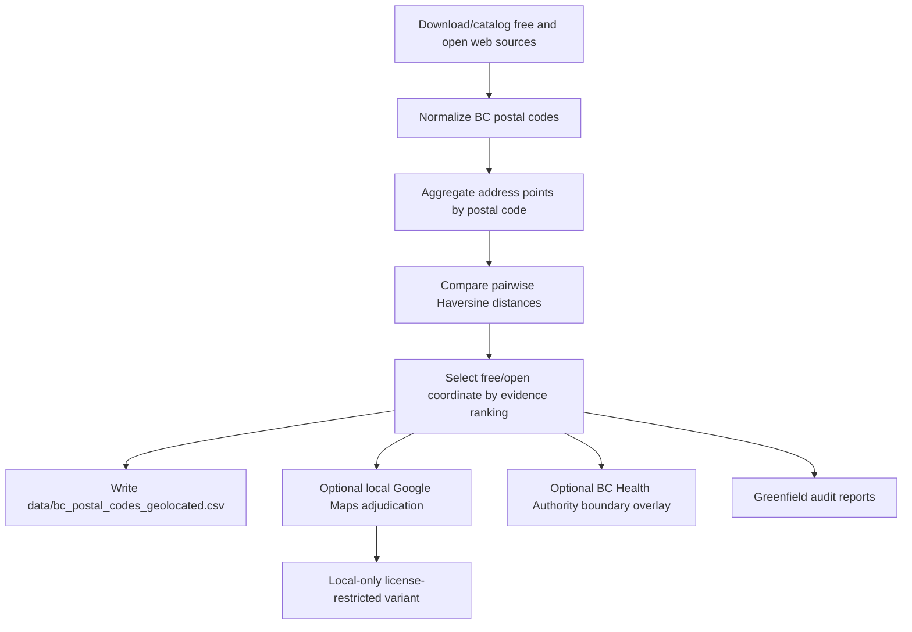

# BC Postal Code Geolocation From Open Sources

[](https://github.com/AndrewMichael2020/bc-postal-code-geolocation-from-open-sources/actions/workflows/ci.yml)


Reconstruct British Columbia postal-code geolocations from web-accessible free and open sources. The repository includes a publishable generated dataset, import scripts, comparison reports, optional local-only adjudication tooling, and audit helpers.

## Dataset

The committed dataset is:

```text
data/bc_postal_codes_geolocated.csv
```

Shape:

| Metric | Value |
| --- | ---: |
| Rows | 123,044 |
| Columns | 4 |
| Postal-code uniqueness | 123,044 unique postal codes |
| Province filter | British Columbia `V*` postal codes |
| Coordinate system | WGS84 latitude/longitude |

Columns:

```text
PostalCodeID,postal_code,latitude,longitude
```

First 10 rows:

| PostalCodeID | postal_code | latitude | longitude |
| --- | --- | ---: | ---: |
| SYN-PC-000001 | V0A 0A0 | 50.959000 | -116.595700 |
| SYN-PC-000002 | V0A 0A1 | 50.509000 | -116.031400 |
| SYN-PC-000003 | V0A 0A2 | 51.120700 | -116.736600 |
| SYN-PC-000004 | V0A 0A3 | 51.120700 | -116.736600 |
| SYN-PC-000005 | V0A 0A4 | 51.120700 | -116.736600 |
| SYN-PC-000006 | V0A 0A5 | 51.120700 | -116.736600 |
| SYN-PC-000007 | V0A 0A6 | 51.296100 | -116.963100 |
| SYN-PC-000008 | V0A 0A7 | 51.070100 | -116.634900 |
| SYN-PC-000009 | V0A 0A8 | 50.827000 | -116.270000 |
| SYN-PC-000010 | V0A 1A0 | 50.540200 | -116.001900 |

The committed dataset is the free/open reconstruction. It has not been cleaned or modified with Google Maps Geocoding. Google-based cleaning is documented below as a local-only QA recipe because Google Maps Platform Geocoding content has caching/storage restrictions; see [ATTRIBUTION.md](ATTRIBUTION.md).

## Business Case

Postal-code geolocation looks like a solved problem until a team needs to trust it. Public maps, open address files, and community data all describe parts of the same world, but they disagree in ways that matter: rural postal codes drift across valleys, stale records survive long after delivery patterns change, and a single bad centroid can distort service-area, logistics, or access analysis.

The practical answer is not to pick one vendor and hope. It is to build a small evidence factory. This project treats each source as a witness with provenance, freshness, license, method, and uncertainty. High-coverage sources provide reach; address-point sources provide precision; OpenStreetMap adds community-maintained evidence; Google Maps can be used sparingly as a local adjudicator when the free/open evidence is risky or contradictory.

That combination changes the operating model. Instead of a static postal-code file that quietly decays, the organization gets a repeatable workflow: rerun imports, inspect what changed, quantify disagreements, reject coarse non-postal answers, and preserve an audit trail. The output is not just latitude and longitude. It is a defensible decision record.

For teams doing planning, routing, public-service analysis, retail coverage, or simulation, that distinction is material. Better geocoding reduces false confidence, makes edge cases visible, and lets analysts separate “known good” from “needs review.” The result is a modest engineering asset with outsized leverage: a local, reproducible, source-aware postal-code geolocation pipeline that can be refreshed when the world changes.

## Source Lineage

Selection lineage for the committed dataset:

| Selected source | Rows |
| --- | ---: |
| GeoNames CA full postal-code dump | 102,027 |
| OpenStreetMap Geofabrik BC extract | 9,373 |
| Statistics Canada ODA BC | 6,878 |
| OpenAddresses BC public layers | 4,766 |

Coordinate methodology:

| Methodology | Rows |
| --- | ---: |
| GeoNames postal-code coordinate | 101,965 |
| Exact medoid address point | 20,319 |
| Single address point | 409 |
| Centroid-nearest address point | 289 |
| GeoNames duplicate exact medoid address point | 62 |

Disagreement class:

| Class | Rows |
| --- | ---: |
| Single source | 97,503 |
| Agree | 19,623 |
| Minor | 3,012 |
| Major | 1,825 |
| Missing from GeoNames seed | 710 |
| Severe | 371 |

Imported source evidence:

| Source | Imported rows | Distinct postal codes | Notes |
| --- | ---: | ---: | --- |
| GeoNames CA full | 122,334 | 122,334 | Daily postal-code dump; high-coverage seed. |
| Statistics Canada ODA BC | 8,149 | 8,149 | Address points grouped to postal-code medoids. |
| OpenAddresses BC | 6,345 | 6,345 | Public layers imported where simple direct parsing was feasible. |
| OSM Geofabrik BC | 13,492 | 13,492 | Local PBF extraction of `addr:postcode` and `postal_code` tags. |

## Workflow



Evidence ranking:

1. Strong multi-address medoid evidence.
2. GeoNames high-coverage seed.
3. OSM, OpenAddresses, or ODA gap fills.
4. Optional Google Maps adjudication for local QA only.

## Suggested Audits

- Review all `major` and `severe` source disagreements before using those rows for high-stakes routing or service-area planning.
- Inspect `single_source` rows by source, especially GeoNames-only rural postal codes.
- Re-run imports monthly or quarterly and compare report hashes, freshness headers, and row-count deltas.
- Run the greenfield coordinate rules audit after every import refresh.
- Treat FSA-prefix coordinates as approximate and avoid replacing full-postal-code evidence with FSA-only evidence.
- Use Google Maps adjudication only as a local QA pass with a ledger and clear retention policy.
- Keep source comparison reports beside any derived operational dataset.

## Install

```bash
python3 -m venv .venv
. .venv/bin/activate
python -m pip install --upgrade pip
python -m pip install -r requirements.txt
```

## Rebuild

Run the free/open import and comparison:

```bash
python scripts/import_postal_sources.py --download-osm-pbf
python scripts/compare_postal_sources.py
```

The comparison writes generated outputs under `outputs/geolocation/`. To refresh the committed CSV after review:

```bash
cp outputs/geolocation/bc_postal_code_reconstructed_free.csv data/bc_postal_codes_geolocated.csv
```

Run the greenfield sanity audit:

```bash
python scripts/audit_greenfield_coordinate_rules.py --refresh-boundaries
```

Run the full workflow through the orchestrator:

```bash
python scripts/run_greenfield_workflow.py --download-osm-pbf --skip-google --refresh-boundaries
```

## Optional Local Google Cleaning Instructions

Google Maps Geocoding can be used to clean and adjudicate risky rows locally, but the resulting latitude/longitude values are not part of the presented dataset in this repository.

Recommended local process:

1. Run the free/open reconstruction first.
2. Generate Google targets without spending API calls.
3. Review target counts against the monthly ledger and budget.
4. Execute the capped pass only if the target set is acceptable.
5. Reject province-only Google results.
6. Mark FSA-prefix results as approximate rather than full-postal-code evidence.
7. Write Google-adjudicated outputs only to ignored local paths.
8. Keep the committed `data/bc_postal_codes_geolocated.csv` as the free/open dataset unless you have independently reviewed publication rights for any additional source.

```bash
python scripts/google_maps_adjudicate_postal_codes.py --stable-qa-limit 1000
python scripts/google_maps_adjudicate_postal_codes.py --stable-qa-limit 1000 --execute
```

Guardrails:

- hard cap: `9,000` requests per calendar month
- ledger: `work/google_maps_geocoding/google_maps_geocoding_ledger.csv`
- province-only results are rejected
- FSA-prefix results are retained only as approximate local evidence
- Google-derived outputs are marked license-restricted and kept out of Git

## Generated Outputs

Generated files are ignored by Git by default:

```text
outputs/geolocation/bc_postal_code_reconstructed_free.csv
outputs/geolocation/bc_postal_code_source_comparison.csv
outputs/geolocation/bc_postal_code_source_summary.csv
outputs/geolocation/postal_code_geolocation_golden.csv
outputs/geolocation/postal_code_geolocation_golden_audit.csv
outputs/geolocation/postal_code_geolocation_golden_rejected.csv
outputs/geolocation/postal_code_geolocation_golden_with_health_authority.csv
reports/geolocation/
work/
```

## Tests

```bash
python scripts/test_postal_reconstruction.py
python -m py_compile scripts/*.py
```

The tests cover normalization, coordinate bounds, Haversine distance, medoid selection, source classification, Google cap accounting, Google result scope, golden-row construction, and Health Authority overlay helpers.
