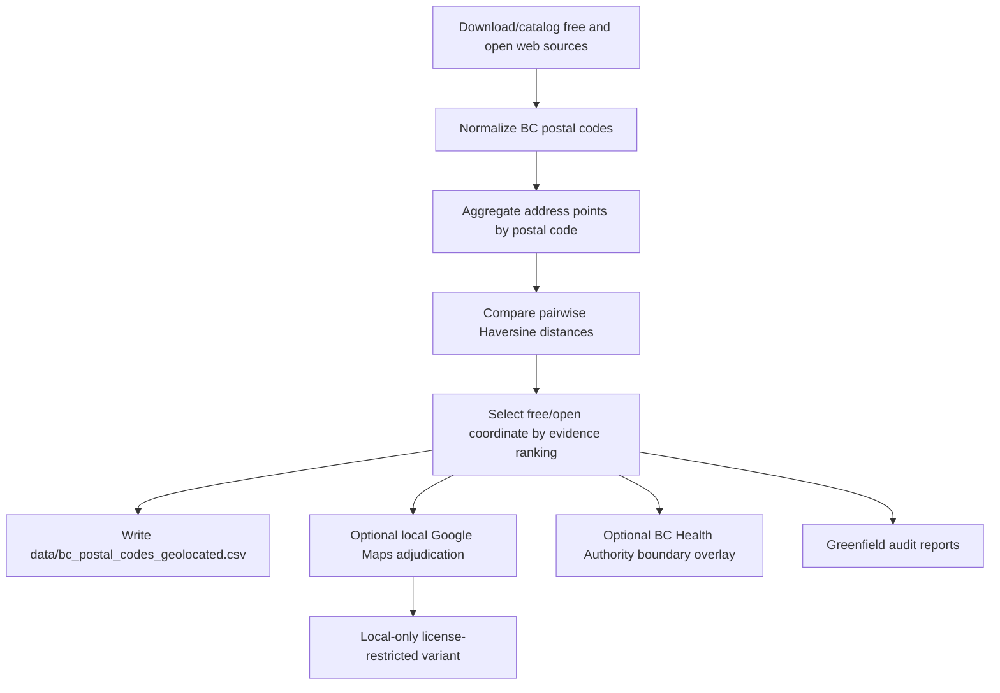

# BC Postal Code Geolocation From Open Sources

[](https://github.com/AndrewMichael2020/bc-postal-code-geolocation-from-open-sources/actions/workflows/ci.yml)
[](https://github.com/AndrewMichael2020/bc-postal-code-geolocation-from-open-sources/actions/workflows/pages.yml)


<p>
  <strong>
    <a href="https://andrewmichael2020.github.io/bc-postal-code-geolocation-from-open-sources/" style="color: #d00000;">
      Live Demo: Fraser Health Home Health Territory Planner
    </a>
  </strong>
</p>

Reconstruct British Columbia postal-code geolocations from web-accessible free and open sources. The repository includes a publishable generated dataset, import scripts, comparison reports, optional local-only adjudication tooling, and audit helpers.

## Dataset

The committed dataset is:

```text
data/bc_postal_codes_geolocated.csv
```

Shape:

| Metric | Value |
| --- | ---: |
| Rows | 123,044 |
| Columns | 4 |
| Postal-code uniqueness | 123,044 unique postal codes |
| Province filter | British Columbia `V*` postal codes |
| Coordinate system | WGS84 latitude/longitude |

Columns:

```text
PostalCodeID,postal_code,latitude,longitude
```

First 10 rows:

| PostalCodeID | postal_code | latitude | longitude |
| --- | --- | ---: | ---: |
| SYN-PC-000001 | V0A 0A0 | 50.959000 | -116.595700 |
| SYN-PC-000002 | V0A 0A1 | 50.509000 | -116.031400 |
| SYN-PC-000003 | V0A 0A2 | 51.120700 | -116.736600 |
| SYN-PC-000004 | V0A 0A3 | 51.120700 | -116.736600 |
| SYN-PC-000005 | V0A 0A4 | 51.120700 | -116.736600 |
| SYN-PC-000006 | V0A 0A5 | 51.120700 | -116.736600 |
| SYN-PC-000007 | V0A 0A6 | 51.296100 | -116.963100 |
| SYN-PC-000008 | V0A 0A7 | 51.070100 | -116.634900 |
| SYN-PC-000009 | V0A 0A8 | 50.827000 | -116.270000 |
| SYN-PC-000010 | V0A 1A0 | 50.540200 | -116.001900 |

The committed dataset is the free/open reconstruction. It has not been cleaned or modified with Google Maps Geocoding. Google-based cleaning is documented below as a local-only QA recipe because Google Maps Platform Geocoding content has caching/storage restrictions; see [ATTRIBUTION.md](ATTRIBUTION.md).

## Demo

The repository includes a static GitHub Pages demo for Fraser Health home health territory planning:

[Fraser Health Home Health Territory Planner](https://andrewmichael2020.github.io/bc-postal-code-geolocation-from-open-sources/)

The demo is a management scenario workspace for longitudinal home health visits. It uses OSRM road travel time and distance from the Fraser Health postal-code-to-facility dataset, then converts travel into an operating-cost estimate using provider time, gas, fuel consumption, and vehicle maintenance assumptions.

The demo no longer uses straight-line distance, fictional hubs, or FSA centroid clusters. It loads a compact browser asset generated from the Git LFS dataset at `outputs/fha_golden_distances_times.csv`:

```text
demo/data/fha-home-health-demo.json
```

Current demo shape:

| Metric | Value |
| --- | ---: |
| Fraser Health postal codes | 41,176 |
| Healthcare facilities | 27 |
| OSRM route candidates in browser asset | 329,408 |
| Full source route pairs in LFS CSV | 1,111,752 |

The browser asset keeps the top route candidates per postal code for fast interaction. It preserves route duration, road distance, facility identity, postal-code coordinates, and compact route-warning labels. The full rich table remains in Git LFS.

Regenerate the demo asset after refreshing the OSRM LFS CSV:

```bash
python3 scripts/build_fha_home_health_demo_assets.py
```

Run the demo locally:

```bash
cd demo
python3 -m http.server 8000
```

Then open `http://127.0.0.1:8000/`.

## Business Case

Imagine North Cascadia Health, a regional operator responsible for moving **patients, nurses, lab samples, and mobile equipment** across British Columbia. On Monday morning, the executive team is reviewing a proposed expansion of mobile care teams. Demand has grown, routes have been stretched, and managers are using a mix of planning assumptions, drive-time rules of thumb, and postal-code service zones to decide where staff should go next. The finance team wants better utilization. Operations wants fewer missed visits and less windshield time. The clinical team wants faster access for patients who cannot easily travel.

Then a planner asks the uncomfortable questions: ***“Are our routes actually optimized? Did our service plan creep as we expanded?”***

The room gets quiet because the answer is not obvious. Postal-code geolocation is usually treated as plumbing, but in routing and service planning it behaves like **strategy**. A postal code placed on the wrong side of a mountain pass can make a service area look *reachable when it is not*. A rural code represented by a broad centroid can hide the distance between a highway community and a remote settlement. A stale commercial lookup can quietly preserve a delivery pattern that no longer exists. These errors do not announce themselves as data-quality problems. They show up later as **missed appointments, unrealistic staffing assumptions, uneven access, and budget variance**.

The tempting response is to buy or pick one source and declare the problem solved. That is tidy, but brittle. Different sources answer different questions. GeoNames offers broad coverage. Address-point datasets offer precision where they exist. OpenStreetMap provides community-maintained evidence in places official files may not cover well. Each source has strengths, blind spots, freshness issues, and licensing constraints. The managerial problem is not simply “find coordinates.” It is ***“make coordinate decisions that can be explained, refreshed, and challenged.”***

This project turns postal-code geolocation into a repeatable evidence process. It imports free and open sources, normalizes postal codes, compares coordinates, classifies disagreements, and records which source won for each row. Instead of hiding uncertainty, **it exposes it**. Executives can see how many rows came from high-coverage seed data, how many were selected from address evidence, and where sources disagree by **kilometres rather than metres**. Analysts can rerun the workflow, inspect changes, and keep the audit trail beside the dataset.

That matters because the same coordinate layer feeds many operating decisions. **Better geolocation** can improve route design, cluster patients or customers into sensible service zones, estimate travel time more honestly, balance caseloads across teams, reduce wasted driving, and test where new capacity should be placed. The implied ROI is not only fewer bad coordinates; it is **better use of staff time, vehicles, appointment slots, and capital**. A transparent geolocation workflow gives leaders a practical control: they can separate stable coordinates from rows that need review, apply local Google Maps adjudication only where it is useful and permitted, and avoid mixing license-restricted outputs into public data products.

For an organization like North Cascadia Health, the value is not just cleaner latitude and longitude. It is **better governance over a quiet but consequential input**. The dataset helps teams plan routes, compare access, simulate demand, and defend decisions with evidence rather than habit. It gives executives confidence that the model is not merely precise, but **accountable**.

## Source Lineage

Every row in the public CSV is chosen from the source-comparison table. In plain language, the workflow asks: “Which source gave us the best available coordinate for this postal code, and how much did the other sources agree with it?”

The counts below separate two different ideas:

- `Imported evidence` means “this source had a usable coordinate for that postal code.”
- `Selected source` means “this source supplied the coordinate that was written to the final CSV.”

That distinction matters for GeoNames. GeoNames supplied evidence for 122,334 postal codes in the final comparison universe. Of those, 102,027 kept the GeoNames coordinate, while 20,307 were present in GeoNames but were assigned a coordinate from OSM, Statistics Canada ODA, or OpenAddresses because that evidence ranked better for the row. Another 710 postal codes were found only outside GeoNames, bringing the public dataset to 123,044 rows.

Selection lineage means the source that supplied the coordinate ultimately written to `data/bc_postal_codes_geolocated.csv`. These are **final selection counts**, not import counts:

| Final coordinate selected from | Rows selected |
| --- | ---: |
| GeoNames coordinate retained from imported evidence | 102,027 |
| OSM/Geofabrik coordinate selected over alternatives | 9,373 |
| Statistics Canada ODA coordinate selected over alternatives | 6,878 |
| OpenAddresses coordinate selected over alternatives | 4,766 |

Coordinate methodology explains what kind of coordinate was selected:

- `GeoNames postal-code coordinate`: GeoNames already had a latitude/longitude for that postal code. This gives broad coverage, but some coordinates are estimated.
- `Exact medoid address point`: multiple address points existed for the postal code; the script picked the real address point closest to the middle of that cluster.
- `Single address point`: only one address point was available, so that point became the coordinate.
- `Centroid-nearest address point`: many address points existed; the script found the average center and selected the real address point nearest that center.
- `GeoNames duplicate exact medoid address point`: multiple GeoNames rows existed for the same postal code and were collapsed with the same medoid-style rule.

| Methodology | Rows |
| --- | ---: |
| GeoNames postal-code coordinate | 101,965 |
| Exact medoid address point | 20,319 |
| Single address point | 409 |
| Centroid-nearest address point | 289 |
| GeoNames duplicate exact medoid address point | 62 |

Disagreement class describes how much the available sources disagreed for the same postal code:

- `Single source`: only one source had evidence, so there was nothing to compare.
- `Agree`: multiple sources were within 250 metres.
- `Minor`: sources differed by more than 250 metres but no more than 1 kilometre.
- `Major`: sources differed by more than 1 kilometre but no more than 10 kilometres.
- `Severe`: sources differed by more than 10 kilometres.
- `Missing from GeoNames seed`: the postal code was found in another free/open source but not in GeoNames.

| Class | Rows |
| --- | ---: |
| Single source | 97,503 |
| Agree | 19,623 |
| Minor | 3,012 |
| Major | 1,825 |
| Missing from GeoNames seed | 710 |
| Severe | 371 |

Imported source evidence:

| Source | Imported rows | Distinct postal codes | Notes |
| --- | ---: | ---: | --- |
| GeoNames CA full | 122,334 | 122,334 | Daily postal-code dump; high-coverage seed. |
| Statistics Canada ODA BC | 8,149 | 8,149 | Address points grouped to postal-code medoids. |
| OpenAddresses BC | 6,345 | 6,345 | Public layers imported where simple direct parsing was feasible. |
| OSM Geofabrik BC | 13,492 | 13,492 | Local PBF extraction of `addr:postcode` and `postal_code` tags. |

## Workflow



Evidence ranking:

1. Strong multi-address medoid evidence.
2. GeoNames high-coverage seed.
3. OSM, OpenAddresses, or ODA gap fills.
4. Optional Google Maps adjudication for local QA only.

## Suggested Audits

- Review all `major` and `severe` source disagreements before using those rows for high-stakes routing or service-area planning.
- Inspect `single_source` rows by source, especially GeoNames-only rural postal codes.
- Re-run imports monthly or quarterly and compare report hashes, freshness headers, and row-count deltas.
- Run the greenfield coordinate rules audit after every import refresh.
- Treat FSA-prefix coordinates as approximate and avoid replacing full-postal-code evidence with FSA-only evidence.
- Use Google Maps adjudication only as a local QA pass with a ledger and clear retention policy.
- Keep source comparison reports beside any derived operational dataset.

## Install

```bash
python3 -m venv .venv
. .venv/bin/activate
python -m pip install --upgrade pip
python -m pip install -r requirements.txt
```

## Rebuild

Run the free/open import and comparison:

```bash
python scripts/import_postal_sources.py --download-osm-pbf
python scripts/compare_postal_sources.py
```

The comparison writes generated outputs under `outputs/geolocation/`. To refresh the committed CSV after review:

```bash
cp outputs/geolocation/bc_postal_code_reconstructed_free.csv data/bc_postal_codes_geolocated.csv
```

Run the greenfield sanity audit:

```bash
python scripts/audit_greenfield_coordinate_rules.py --refresh-boundaries
```

Run the full workflow through the orchestrator:

```bash
python scripts/run_greenfield_workflow.py --download-osm-pbf --skip-google --refresh-boundaries
```

## Optional Local Google Cleaning Instructions

Google Maps Geocoding can be used to clean and adjudicate risky rows locally, but the resulting latitude/longitude values are not part of the presented dataset in this repository.

As of the current Google Maps Platform pricing page checked on July 3, 2026, Geocoding is an `Essentials` SKU with **10,000 free billable events per month**. Usage is calculated monthly across projects linked to the billing account; after the free monthly cap, Geocoding is billed per 1,000 events using tiered pricing. Google’s Geocoding usage page also states that billing must be enabled and requests must include an API key or OAuth token. The Geocoding API has a per-minute usage restriction; Google’s usage page currently describes a 3,000 queries-per-minute limit. Always confirm the current pricing page before running a new batch.

Storage and use rules matter. Google’s Geocoding policy says content pre-fetching, caching, or storage is generally restricted, with place IDs called out as the main exception. That is why this repository documents Google as a local cleaning process but does not publish Google-derived latitude/longitude values.

Recommended local process:

1. Create or select a Google Cloud project.
2. Enable billing for that project. Google requires billing even when you plan to stay inside the free monthly event allowance.
3. Enable the Geocoding API for the project.
4. Create an API key, restrict it to the Geocoding API, and apply any practical application restrictions for your environment.
5. Put the key in a local `.env` file as `GOOGLE_MAPS_API_KEY=...`; do not commit the key.
6. Run the free/open reconstruction first.
7. Generate Google targets without spending API calls.
8. Review target counts against `work/google_maps_geocoding/google_maps_geocoding_ledger.csv`, the monthly budget, and the 10,000-event free monthly cap.
9. Execute the capped pass only if the target set is acceptable.
10. Reject province-only Google results.
11. Mark FSA-prefix results as approximate rather than full-postal-code evidence.
12. Write Google-adjudicated outputs only to ignored local paths.
13. Keep the committed `data/bc_postal_codes_geolocated.csv` as the free/open dataset unless you have independently reviewed publication rights for any additional source.

```bash
python scripts/google_maps_adjudicate_postal_codes.py --stable-qa-limit 1000
python scripts/google_maps_adjudicate_postal_codes.py --stable-qa-limit 1000 --execute
```

Guardrails:

- project script hard cap: `9,000` requests per calendar month, leaving a 1,000-event cushion below the 10,000-event free monthly allowance
- ledger: `work/google_maps_geocoding/google_maps_geocoding_ledger.csv`
- province-only results are rejected
- FSA-prefix results are retained only as approximate local evidence
- Google-derived outputs are marked license-restricted and kept out of Git

## Generated Outputs

Generated files are ignored by Git by default:

```text
outputs/geolocation/bc_postal_code_reconstructed_free.csv
outputs/geolocation/bc_postal_code_source_comparison.csv
outputs/geolocation/bc_postal_code_source_summary.csv
outputs/geolocation/postal_code_geolocation_golden.csv
outputs/geolocation/postal_code_geolocation_golden_audit.csv
outputs/geolocation/postal_code_geolocation_golden_rejected.csv
outputs/geolocation/postal_code_geolocation_golden_with_health_authority.csv
reports/geolocation/
work/
```

## Tests

```bash
python scripts/test_postal_reconstruction.py
python -m py_compile scripts/*.py
```

The tests cover normalization, coordinate bounds, Haversine distance, medoid selection, source classification, Google cap accounting, Google result scope, golden-row construction, and Health Authority overlay helpers.
